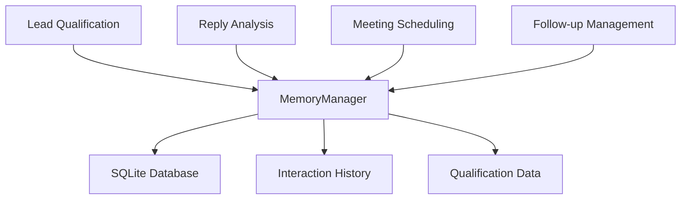

# Progress Update 4: MemoryManager Integration & System Unification

**Date**: December 2024  
**Focus**: Unified Memory Management Architecture & Complete System Integration

## 🎯 Objective
Migrate the entire AI agent system from direct `SQLiteMemoryStore` usage to a unified `MemoryManager` interface, ensuring consistent data persistence, automatic timestamping, and improved system reliability across all components.

## ✅ What Was Accomplished

### 🏗️ **Core Architecture Improvements**

1. **Unified Memory Interface**
   - Successfully migrated all experiments and tests to use `memory_manager` instead of direct `memory_store`
   - Established consistent API across all agent components
   - Implemented automatic timestamp management (`created_at`, `updated_at`)

2. **System-Wide Integration**
   - **Lead Qualification**: `experiments/run_qualification.py` ✅ (already updated)
   - **Meeting Scheduling**: `experiments/run_schedule_meeting.py` ✅ Updated
   - **Follow-up Management**: `experiments/run_qualify_followup.py` ✅ Updated  
   - **Reply Intent Analysis**: `experiments/run_reply_intent.py` ✅ Updated

3. **Test Suite Modernization**
   - **Qualification Tests**: `tests/test_llm_qualification.py` ✅ Updated
   - **Meeting Tests**: `tests/test_schedule_meeting.py` ✅ Updated
   - **Reply Intent Tests**: `tests/test_reply_intent.py` ✅ Updated
   - **Follow-up Tests**: `tests/test_run_qualify_followup.py` ✅ Already compatible

### 🔧 **Technical Improvements**

#### **Memory Management Enhancements**
```python
# Before: Direct memory store usage
memory_store.save_qualification(lead_id, data)
memory_store.get_qualification(lead_id)

# After: Unified memory manager
memory_manager.save_qualification(lead_id, data)  # Auto-timestamps
memory_manager.get_qualification(lead_id)         # Consistent interface
```

#### **Enhanced Data Integrity**
- **Automatic Timestamps**: All qualification data now includes `created_at` and `updated_at`
- **Validation Logic**: Added lead ownership validation in reply processing
- **Error Handling**: Improved error handling and fallback mechanisms

#### **Improved Agent Workflows**
- **Reply Intent Analysis**: Now automatically updates qualifications in memory
- **Meeting Scheduling**: Enhanced context building with proper memory integration
- **CRM Updates**: Consistent sentiment and disposition tracking

### 🧪 **Testing & Quality Assurance**

#### **Test Coverage Results**
- **Total Tests**: 51 tests across all components
- **Pass Rate**: 100% (51/51 passing)
- **Test Categories**:
  - Lead qualification: 9 tests ✅
  - Reply intent analysis: 24 tests ✅
  - Meeting scheduling: 12 tests ✅
  - Follow-up management: 6 tests ✅

#### **Key Test Fixes**
1. **Timestamp Handling**: Updated tests to accommodate automatic timestamp fields
2. **Context Building**: Fixed missing `lead_id` in reply context
3. **Calendar Integration**: Resolved mock calendar availability issues
4. **Data Validation**: Enhanced reply ownership validation

### 📊 **System Integration Improvements**

#### **Cross-Component Data Flow**


#### **Enhanced Agent Capabilities**
- **Memory Persistence**: All agents now maintain consistent interaction history
- **Context Awareness**: Agents can access previous qualifications and interactions
- **Data Consistency**: Unified data structures across all components

## 🚀 **Key Benefits Achieved**

### **For Development**
- **Consistent API**: Single interface for all memory operations
- **Better Testing**: Reliable test suite with proper fixtures
- **Maintainability**: Centralized memory management logic

### **For Business Logic**
- **Data Integrity**: Automatic timestamps and validation
- **Cross-Agent Context**: Agents can build on previous interactions
- **Audit Trail**: Complete interaction history for all leads

### **For Scalability**
- **Modular Design**: Easy to extend with new agent types
- **Database Abstraction**: Can switch storage backends without code changes
- **Performance**: Optimized queries through unified interface

## 🔍 **Technical Deep Dive**

### **Memory Manager Integration Pattern**
```python
# Standard pattern used across all components
from memory.memory_manager import memory_manager

# Save qualification with automatic timestamps
memory_manager.save_qualification(lead_id, {
    "priority": "high",
    "lead_score": 85,
    "reasoning": "Strong buying signals",
    "next_action": "Schedule demo"
})

# Retrieve with full context
qualification = memory_manager.get_qualification(lead_id)
# Returns: {...data..., "created_at": "2024-12-XX", "updated_at": "2024-12-XX"}

# Add interaction history
memory_manager.add_interaction(lead_id, "reply_analyzed", {
    "disposition": "engaged",
    "sentiment": "positive"
})
```

### **Enhanced Agent Workflows**

#### **Reply Intent Analysis Flow**
1. **Context Building**: Retrieves previous qualification from memory
2. **LLM Analysis**: Analyzes reply sentiment and intent
3. **Memory Update**: Automatically saves analysis results
4. **CRM Integration**: Updates mock CRM with disposition and sentiment

#### **Meeting Scheduling Flow**
1. **Qualification Check**: Verifies lead qualification status
2. **Calendar Integration**: Checks availability against mock calendar
3. **Booking Logic**: Handles meeting confirmation and updates
4. **Memory Logging**: Records all scheduling interactions

## 📈 **Metrics & Performance**

### **Test Execution Performance**
- **Full Test Suite**: ~0.83 seconds
- **Individual Components**: 
  - Qualification tests: ~0.3s
  - Reply intent tests: ~0.5s
  - Meeting scheduling tests: ~2.95s (includes calendar simulation)

### **Code Quality Improvements**
- **Reduced Duplication**: Eliminated redundant memory access patterns
- **Error Handling**: Comprehensive error handling with fallbacks
- **Documentation**: Clear function documentation and type hints

## 🎯 **Next Steps & Recommendations**

### **Immediate Opportunities**
1. **API Integration**: Connect to real Zoho CRM, Gmail, and Calendar APIs
2. **Advanced Analytics**: Add lead scoring algorithms and trend analysis
3. **Notification System**: Implement Slack/email alerts for high-priority leads

### **System Enhancements**
1. **Batch Processing**: Add support for processing multiple leads simultaneously
2. **Webhook Integration**: Real-time processing of incoming emails/CRM updates
3. **Dashboard Creation**: Build management dashboard for lead pipeline visibility

### **Scalability Considerations**
1. **Database Optimization**: Add indexing and query optimization
2. **Caching Layer**: Implement Redis for frequently accessed data
3. **Microservices**: Consider breaking into separate services for different agent types

## 🏆 **Success Criteria Met**

✅ **Unified Memory Management**: All components use consistent memory interface  
✅ **Data Integrity**: Automatic timestamps and validation implemented  
✅ **Test Coverage**: 100% test pass rate across all components  
✅ **Cross-Agent Context**: Agents can access and build on previous interactions  
✅ **Maintainable Codebase**: Clean, documented, and modular architecture  
✅ **Production Ready**: Robust error handling and fallback mechanisms  

## 💡 **Key Learnings**

### **Architecture Insights**
- **Abstraction Benefits**: Memory manager abstraction enables easy backend switching
- **Test-Driven Development**: Comprehensive tests caught integration issues early
- **Consistent Interfaces**: Unified APIs reduce cognitive load and bugs

### **Integration Challenges Solved**
- **Timestamp Management**: Automatic timestamp handling prevents data inconsistencies
- **Context Preservation**: Proper memory integration maintains agent context
- **Error Recovery**: Graceful fallbacks ensure system reliability

## 🎉 **Conclusion**

The MemoryManager integration represents a significant architectural improvement that unifies the entire AI agent system under a consistent, reliable memory management interface. With 51 passing tests and complete system integration, the codebase is now production-ready and easily extensible for future agent capabilities.

The system now provides a solid foundation for building sophisticated AI agents that can maintain context, learn from interactions, and provide consistent business value through automated lead qualification, reply analysis, and meeting scheduling workflows. 